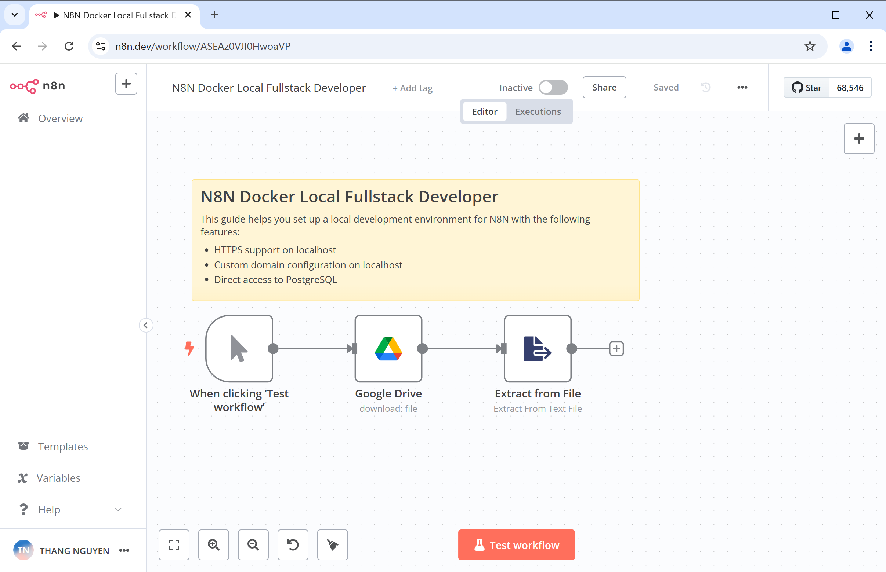
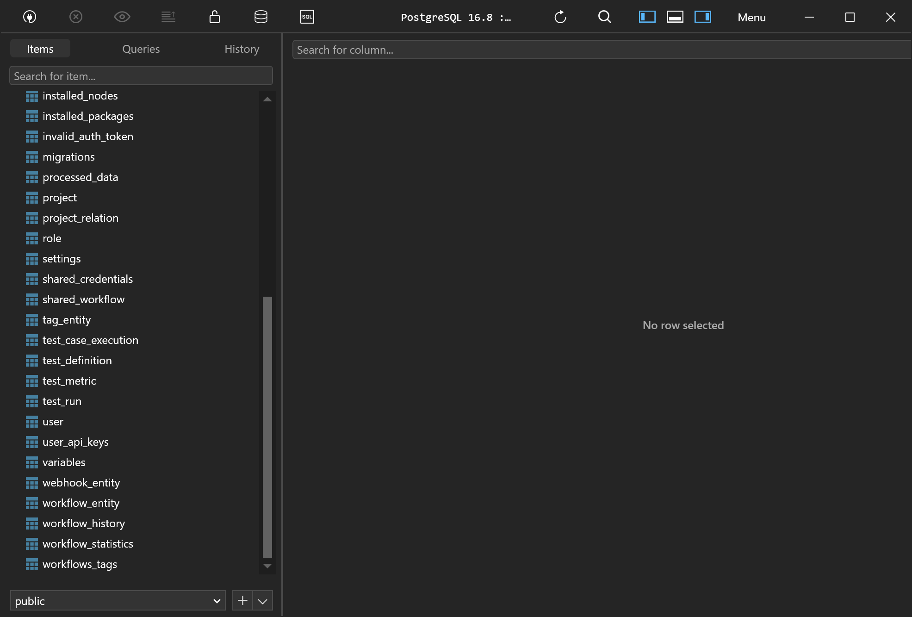

# Hướng Dẫn Phát Triển Fullstack N8N Trên Docker

Hướng dẫn này giúp bạn thiết lập môi trường phát triển cục bộ cho N8N với các tính năng sau:
- Hỗ trợ HTTPS trên localhost
- Cấu hình tên miền tùy chỉnh trên localhost
- Truy cập trực tiếp vào PostgreSQL

## Hướng Dẫn Cài Đặt

### Cài đặt các phần mềm

#### Dành Cho Người Dùng Windows

1. **Cài Đặt Chocolatey**:
   - Làm theo hướng dẫn tại: [Hướng Dẫn Cài Đặt Chocolatey](https://chocolatey.org/install)

2. **Cài Đặt mkcert**:
   - Mở PowerShell và chạy: `choco install mkcert`

3. **Tin Cậy Chứng Chỉ Cục Bộ**:
   - Trong PowerShell, thực thi: `mkcert -install`

### Thiết Lập Dự Án

1. **Tạo và Clone Dự Án**:
   - Tạo thư mục dự án: `mkdir n8n-localhost`
   - Clone repository: `git clone https://github.com/thangnqs/n8n-localhost.git .`

2. **Tạo Chứng Chỉ SSL**:
   - Điều hướng đến thư mục chứng chỉ: `cd nginx/certs`
   - Tạo các tệp chứng chỉ: `mkcert n8n.dev`
   - Điều này sẽ tạo hai tệp: `n8n.dev-key.pem` và `n8n.dev.pem`

3. **Cập Nhật Tệp Hosts**:
   - Mở tệp hosts tại: `C:\Windows\System32\drivers\etc\hosts`
   - Thêm dòng sau: `127.0.0.1 n8n.dev`
   - Lưu tệp.

5. **Cập Nhật Tệp `.env`**:
   - Mở tệp `.env` trong thư mục dự án của bạn và cập nhật các giá trị sau:

   ```plaintext
   POSTGRES_USER=changeUser
   POSTGRES_PASSWORD=changePassword
   POSTGRES_DB=n8n

   POSTGRES_NON_ROOT_USER=changeUser
   POSTGRES_NON_ROOT_PASSWORD=changePassword
   ```
4. **Chạy N8N**

   - Khởi động docker và chạy ```docker compose up -d```


### Cách kết nối PostgreSQL?

Để kết nối với cơ sở dữ liệu PostgreSQL, sử dụng các thông tin sau:

- **Host**: `localhost`
- **User**: Giá trị của `POSTGRES_USER` từ tệp `.env`
- **Password**: Giá trị của `POSTGRES_PASSWORD` từ tệp `.env`
- **Database**: `n8n`

Khi mọi thứ đã được thiết lập, mở trình duyệt của bạn và truy cập: `https://n8n.dev`.

Bạn đã sẵn sàng sử dụng N8N với HTTPS và tên miền tùy chỉnh trên máy cục bộ.


### Demo






### Chú ý:

Chỉ phù hợp cho sử dụng trong môi trường Development.