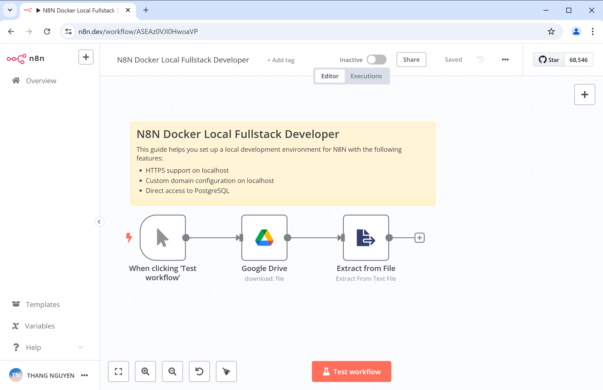
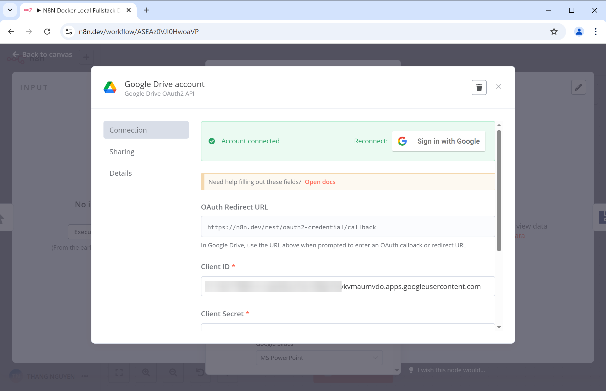
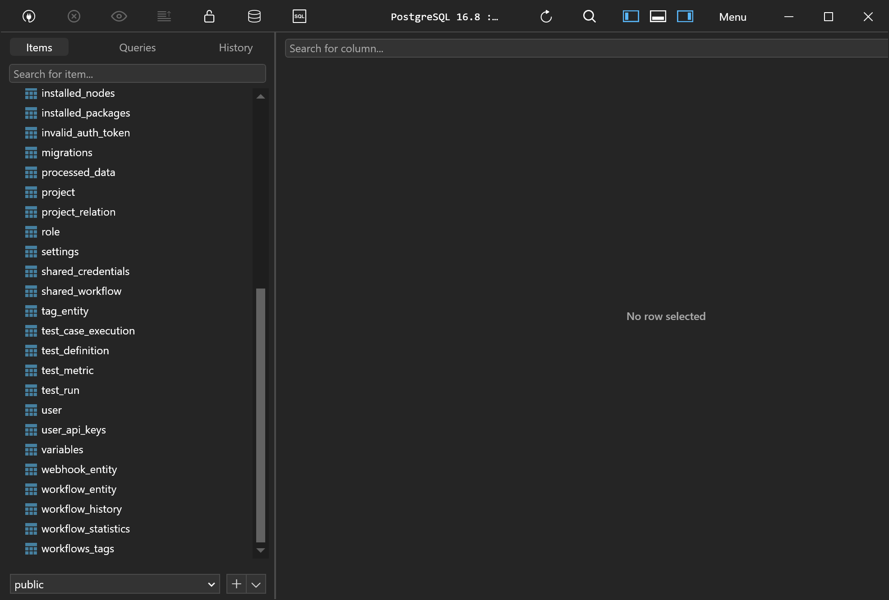

# N8N Docker Local Fullstack Developer Guide

This guide helps you set up a local development environment for N8N with the following features:
- HTTPS support on localhost
- Custom domain configuration on localhost
- Direct access to PostgreSQL

## Setup Instructions

### Prerequisites Installation

#### For Windows Users

1. **Install Chocolatey**:
   - Follow the instructions at: [Chocolatey Installation Guide](https://chocolatey.org/install)

2. **Install mkcert**:
   - Open PowerShell and run: `choco install mkcert`

3. **Trust Local Certificates**:
   - In PowerShell, execute: `mkcert -install`

### Project Setup

1. **Create and Clone the Project**:
   - Create a project folder: `mkdir n8n-simple`
   - Clone the repository: `git clone https://github.com/thangtuts/n8n-localhost.git`

2. **Generate SSL Certificates**:
   - Navigate to the certificates directory: `cd nginx/certs`
   - Generate the certificate files: `mkcert n8n.dev`
   - This will create two files: `n8n.dev-key.pem` and `n8n.dev.pem`

3. **Update the Hosts File**:
   - Open the hosts file located at: `C:\Windows\System32\drivers\etc\hosts`
   - Add the following line: `127.0.0.1 n8n.dev`
   - Save the file.

5. **Update the `.env` File**:
   - Open the `.env` file in your project directory and update the following values:

   ```plaintext
   POSTGRES_USER=changeUser
   POSTGRES_PASSWORD=changePassword
   POSTGRES_DB=n8n

   POSTGRES_NON_ROOT_USER=changeUser
   POSTGRES_NON_ROOT_PASSWORD=changePassword
   ```
4. **Run N8N**

   - Start docker and ```docker compose up -d```


### Accessing PostgreSQL?

To connect to the PostgreSQL database, use the following details:

- **Host**: `localhost`
- **User**: The value of `POSTGRES_USER` from the `.env` file
- **Password**: The value of `POSTGRES_PASSWORD` from the `.env` file
- **Database**: `n8n`

Once everything is set up, open your browser and navigate to: `https://n8n.dev`.

You are now ready to use N8N with HTTPS and a custom domain on your local machine.


### N8N Localhost Preview








### Support My Work

If you find this guide helpful, consider supporting me by donating. Simply scan the QR code below:


### Disclaimer: Not Suitable for Production Use

This setup is intended for local development and testing purposes only. It is not recommended for production environments.